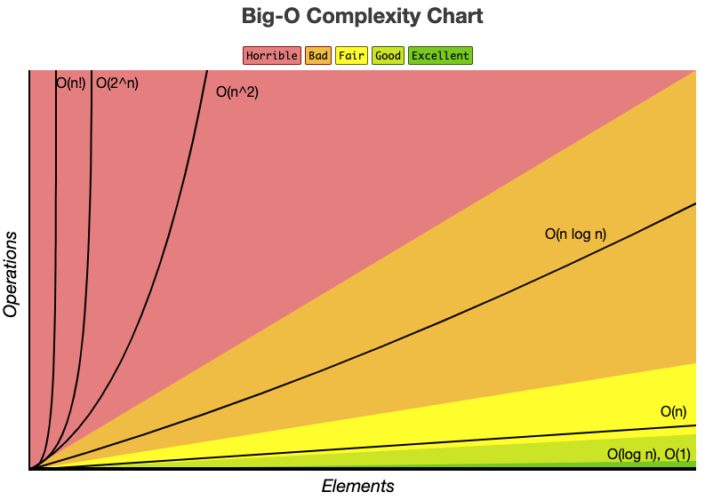

## 复杂度

### 大 O 表示法

在算法的效率里面，通常是用资源，例如 CPU(时间)占用、内存占用、硬盘占用和网络占用。当用大 O 表示时，一般是考虑的是 CPU (时间) 占用。

- O(1): Constant Complexity: Constant 常数复杂度
- O(log n): Logarithmic Complexity: 对数复杂度
- O(n): Linear Complexity: 线性时间复杂度
- O(n<sup>2</sup>): N square Complexity 平⽅方
- O(n<sup>3</sup>): N square Complexity ⽴立⽅方
- O(2<sup>n</sup>): Exponential Growth 指数
- O(n!): Factorial 阶乘


- [大O 复杂度速查](https://www.bigocheatsheet.com/)

- **O(1)**

当下面函数，无论传什么参数运行一次函数，执行时间都一样，执行时间和参数无关，所以是 **O(1)** 常数。
```js
function increment(num) {
  return ++num
}
```

- **O(n)**

下面函数查找值的次数时间占用O，跟 array.length 有关，在最坏的情况下会全部遍历一遍, 所以函数的时间复杂度就是 **O(n)**, **n** 是(输入) 数组的大小。

```js
function sequentialSearch(array, value, equalsFn = defaultEquals) {
  for (let i = 0; i < array.length; i++) {
    if (equalsFn(value, array[i])) {
      return i
    }
  }
  return -1
}
```

- **O(n<sup>2</sup>)**

时间复杂度 **O(n)** 的代码只有一层循环，而 **O(n<sup>2</sup>)**的代码有双层嵌套循环，如果算法有三层迭代数组的嵌套循环，它的时间复杂度很可能就是 **O(n<sup>3</sup>)**
```js
function bubbleSort(array, compareFn = defaultCompare) {
  const { length } = array
  for (let i = 0; i < length; i++) {
    for (let j = 0; j < length; j++) {
      if (compareFn(array[j], array[j+1]) === Compare.BIGGER_THAN) {
        swap(array, j, j+1)
      }
    }
  }
  return array
}
```

- **O(logN)**

下面函数会使用时间会对数式减少， 或者二分查找法最坏的情况会出现 **O(logN)** 的复杂度。

```js
var count = 1
while(count < n) {
  count = count * 2
}
```


一般来说，如果一个算法复杂度为 **O(n<sup>k</sup>)**, 其中 k 是常数， 我们就认为这个算法是高效的，

