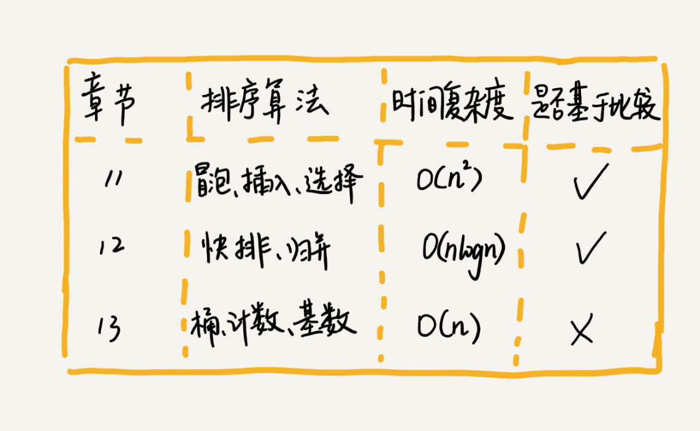
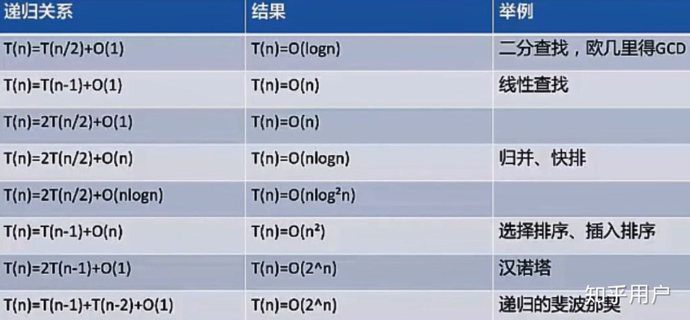

## 算法知识学习手册

数据结构与算法框架

- [时间空间复杂度](./Complexity/complexity.md)

### 排序基于复杂度分类

比较的排序算法的执行过程，会涉及两种操作，一是元素比较大小，另一种是元素交换或移动。

原地排序(Sorted in place)算法，是特指空间复杂度是 **O(1)**的排序算法。

双迭代排序
- [冒泡排序](./BubbleSort/bubble.md)
- [选择排序](./SelectionSort/SelectionSort.md)
- [插入排序](./InsertionSort/InsertionSort.md)

分组排序
- [归并排序](./MergeSort/MergeSort.md)
- [快速排序](./QuickSort/QuickSort.md)

- [希尔排序](./ShellSort/SheelSort.md) 插入排序的优化
- [计数排序](./CountingSort/CountingSort.md)
- [桶排序](./BucketSort/BucketSort.md)
- [基数排序](./RadixSort/RadixSort.md)
- [顺序搜索](./SequentialSearch/SequentialSearch.md)
- [内插搜索](./InterpolationSearch/InterpolationSearch.md)
- [二分搜索](./BinarySearch/BinarySearch.md)

其它偏排序

猴子排序
睡眠排序
面条排序

如何分析一个"排序算法"的好坏?

- 排序算法的执行效率
1. 最好情况，最坏情况，平均情况时间复杂度
2. 时间复杂度的系数、常数、低阶
3. 比较次数和交换(或移动)次数

- 排算算法的内存消耗
算法的内存消耗可以通过空间复杂度来衡量，**原地排序**,是特指空间复杂度是 **O(1)** 的排序算法。

- 排序算法的稳定性
稳定性是指，如果待排序的序列中存在值相等的元素，经过排序之后，相等元素之间原有的先后顺序不变。

### 递归
- [递归](./Recursion/Recursion.md)

### 动态规划

- [* 动态规划](https://www.zhihu.com/question/23995189)
- [* 动态规划解题套路框架](https://labuladong.gitbook.io/algo/dong-tai-gui-hua-xi-lie/1.1-dong-tai-gui-hua-ji-ben-ji-qiao/dong-tai-gui-hua-xiang-jie-jin-jie)
- [* 怎样学好动态规划？](https://www.zhihu.com/question/291280715/answer/1570410869?utm_source=wechat_session&utm_medium=social&utm_oi=629243178457370624&utm_content=group3_Answer&utm_campaign=shareopn)

### 贪心算法
- [* 贪心算法](https://zh.wikipedia.org/wiki/%E8%B4%AA%E5%BF%83%E7%AE%97%E6%B3%95)

### 循环vs迭代vs遍历

共同点在于，都是通过一个多次的重复的操作计算出最终的结果。

- 遍历，依次对集合中的每个元素做且公做一次访问
- 递归，不断通过自身调用去缩小范围b，直到找到或尽头返回。使用调用自身函数来触发。
- 迭代，是执行很多次,每次都运行上一次的结果，来向目标推进一点，直到找到结果。使用 `while`, `for` 循环条件来运行。

递归算法复杂度，要根据递归的关系来算出来。

### 优秀文章

- [十大经典排序算法（动图演示）](https://www.cnblogs.com/onepixel/p/7674659.html)
- [大O 复杂度速查](https://www.bigocheatsheet.com/)
- [js实现排序算法（冒泡、选择、插入、二分插入、快速、希尔）](https://blog.csdn.net/charlene0824/article/details/51387165)
- [* 算法的时间和空间复杂度，就是这么简单](https://www.toutiao.com/a6750625828465279495)
- [* 前端该如何准备数据结构和算法？](https://juejin.im/post/5d5b307b5188253da24d3cd1)
- [* 算法动态图](https://visualgo.net/)

广义定义:
数据结构就 是指一组数据的存储结构。
算法就是操作数据的一组方法。

狭义
是指队列，栈，堆，二分查找，动态规划等。

数据结构和算法是相辅相成的，数据结构是为算法服务的，算法要作用在特定的数据结构之上。

### 数据结构
[数据结构](https://github.com/ClarenceC/data_structure_learn)