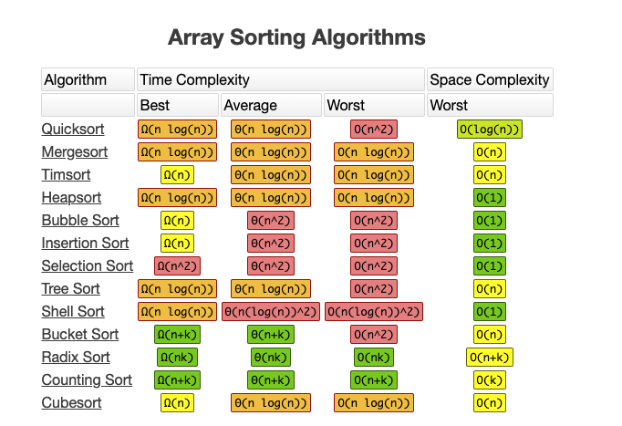

## 算法知识学习手册

- [复杂度](./Complexity/complexity.md)

- [冒泡排序](./BubbleSort/bubble.md)
- [选择排序](./SelectionSort/SelectionSort.md)
- [插入排序](./InsertionSort/InsertionSort.md)
- 希尔排序
- [归并排序](./MergeSort/MergeSort.md)
- [快速排序](./QuickSort/QuickSort.md)
- 计数排序
- 桶排序
- 基数排序
- 顺序搜索
- 内插搜索
- 二分搜索

- [十大经典排序算法（动图演示）](https://www.cnblogs.com/onepixel/p/7674659.html)